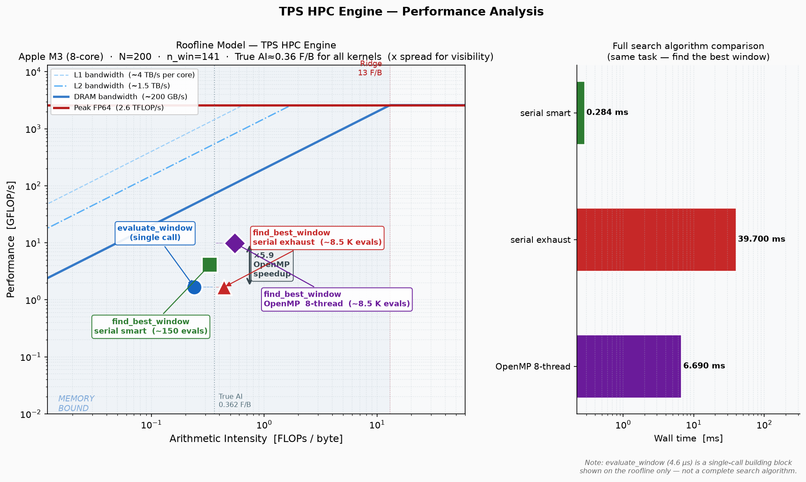

# tps-hpc-engine

> High-performance C++/MPI/OpenMP engine for Transient Plane Source thermal analysis

## Overview

This project replaces the Python/NumPy analysis core of a TPS thermal conductivity measurement system with a high-performance C++ engine. It demonstrates a full HPC optimization workflow: profiling → OpenMP parallelisation → MPI-based Monte Carlo uncertainty quantification.

The analysis engine integrates back into [HD_Intelligent](https://github.com/BitnooriLee/HD_Intelligent) (private) via **pybind11** as a drop-in accelerator — no changes to the Python pipeline required.

## Quick Start (No Hardware, 10 Minutes)

If you only want to verify the engine locally (without lab equipment), run this from repository root:

```bash
# 1) Configure
cmake -S . -B build \
  -DCMAKE_BUILD_TYPE=Release \
  -DENABLE_OPENMP=ON \
  -DENABLE_MPI=ON \
  -DENABLE_PYBIND=ON

# 2) Build (cross-platform)
cmake --build build --parallel

# 3) Python end-to-end demo (Step 5-7 only)
PYTHONPATH=build python3 python/demo.py

# 4) Native executables
./build/tps_serial
OMP_NUM_THREADS=8 ./build/tps_openmp
OMP_NUM_THREADS=8 ./build/bench_residual
mpirun -n 4 ./build/tps_mpi_uq data/example_res_response.txt 1000 0.02
```

Expected behavior:
- `python/demo.py` prints one serial result, one OpenMP result, and a TPS summary.
- `bench_residual` should show OpenMP exhaustive faster than serial exhaustive.
- `tps_mpi_uq` should print acceptance rate and 95% CI/PI.

---

## Data Flow

The TPS measurement pipeline has two distinct phases:

```
[Hardware — requires physical lab setup]

  Step 1: Keithley 2450 applies heating pulse → raw resistance data
  Step 2: Python writes .hotb file (XML metadata + measurement config)
  Step 3: Hot Disk Software opens .hotb, runs TPS calculation
  Step 4: Python sends "EXP:RES?" over TCP → Hot Disk responds with
          raw (sqrt_t, dT) time-series string:
            "0.2236 0.0312\r0.3162 0.0441\r0.3873 0.0540\r..."

[C++ engine takes over from here]

  Step 5: Python parses the EXP:RES? response → x_vals[], y_vals[]
          (existing _parse_pairs() in HD_Intelligent, unchanged)
  Step 6: Python calls C++ engine via pybind11:
            import tps_engine
            result = tps_engine.find_best_window_serial(x_vals, y_vals)
  Step 7: C++ returns result dict → Python pipeline continues
```

The C++ engine is **only responsible for Steps 5–7**. It never touches `.hotb` files, TCP sockets, or the Keithley instrument.

---

## Development Without Hardware

Steps 1–4 require a physical Hot Disk lab setup. For development and benchmarking, `data/example_res_response.txt` provides a representative EXP:RES? response captured from a real measurement. This file feeds directly into Step 5.

```bash
# Full Step 5-7 demo via Python bindings (no hardware needed)
cmake -S . -B build -DCMAKE_BUILD_TYPE=Release -DENABLE_OPENMP=ON -DENABLE_PYBIND=ON
cmake --build build --target tps_engine
PYTHONPATH=build python3 python/demo.py
```

The standalone C++ binaries work without Python:

```bash
# Serial baseline
./build/tps_serial

# OpenMP exhaustive search
OMP_NUM_THREADS=8 ./build/tps_openmp

# 3-way timing benchmark: smart / exhaustive / OMP
OMP_NUM_THREADS=8 ./build/bench_residual

# MPI Monte Carlo UQ  (4 ranks, 10 000 trials, σ=0.02 K)
mpirun -n 4 ./build/tps_mpi_uq data/example_res_response.txt 10000 0.02
```

---

## Performance & Roofline Analysis

> Measured on **Apple M3 (8-core)**, N = 200 data points, `bench_profile` (2 000 reps).

### Per-function timing — `evaluate_window` hot path

`evaluate_window()` is the core primitive called inside every window search loop.  
Profiling reveals which statistical test dominates wall-time:

| Function | Mean time | Share |
|---|---|---|
| `runs_test` | 1.56 µs | **33.8 %** — #1 bottleneck |
| `spearman_corr` | 1.26 µs | 27.1 % — #2 bottleneck |
| `pearson_corr` | 0.44 µs | 9.5 % |
| `durbin_watson` | 0.34 µs | 7.3 % |
| `linear_fit` | 0.31 µs | 6.7 % |
| **`evaluate_window` total** | **4.63 µs** | 100 % |

Both top bottlenecks contain an **O(n log n) sort** (median ranking / Spearman ranks).

### Search algorithm comparison

세 알고리즘 모두 **동일한 작업** (전체 데이터에서 최적 창 찾기)을 수행합니다.

| Algorithm | Wall time | vs serial exhaustive |
|---|---|---|
| Serial smart search (~150 evals) | **0.28 ms** | **×140 faster** |
| Serial exhaustive (~8 500 evals) | 39.7 ms | baseline |
| OpenMP 8-thread exhaustive | **6.7 ms** | **×5.9 speedup** |

> `evaluate_window` (4.6 µs) 는 창 **1개**를 평가하는 building block이며 위 알고리즘들의 내부 호출 단위입니다. 전체 탐색 알고리즘과 직접 비교하는 것은 사과 vs 오렌지 비교이므로, roofline 패널의 참조점으로만 표시합니다.

### Python binding round-trip overhead (pybind11, N = 200)

| Call | Time |
|---|---|
| `tps_engine.find_best_window_serial` | ~0.7 ms |
| `tps_engine.find_best_window_omp` | ~11 ms |
| `tps_engine.evaluate_window` | ~0.03 ms |

### MPI Monte Carlo UQ (4 ranks × 1 000 trials)

| Metric | Value |
|---|---|
| Total trials | 4 000 |
| Acceptance rate | 100 % |
| Wall time per rank | ~205 ms |
| k_proxy CV | 8.2 % |
| 95 % CI on mean | [1.7398, 1.7487] |
| 95 % PI (distribution) | [1.4496, 1.9295] |

---

## Roofline Model



> Generated by `python3 scripts/roofline.py` from measured `bench_profile` data.  
> **Left:** Classic roofline (log-log) — all 4 points plotted including `evaluate_window` as a building-block reference.  
> **Right:** Wall-time comparison of the **3 complete search algorithms only** (same task, fair comparison).  
> x-axis positions are slightly spread for visual clarity; true AI ≈ 0.36 F/B for all kernels.

### How to read the chart

The **diagonal blue line** is the DRAM bandwidth roof (slope = 200 GB/s):  
no kernel can exceed `AI × BW` GFLOP/s, no matter how fast the CPU is.  
The **horizontal red line** is the compute ceiling (2.6 TFLOP/s).  
They meet at the **ridge point (13 F/B)** — kernels to the left are memory-bound, kernels to the right are compute-bound.

### Key insights

**1. All kernels are memory-bandwidth limited.**  
Arithmetic intensity AI = FLOPs ÷ bytes = (55 × 141) ÷ (19 × 141 × 8) = **0.36 F/B**, well below the ridge at 13 F/B. The CPU's compute units are starved, not the bottleneck.

**2. The bottleneck is sorting, not arithmetic.**  
`runs_test` (34 %) and `spearman_corr` (27 %) together account for 62 % of `evaluate_window` wall-time. Both call `std::sort()` — an O(n log n) operation with irregular memory access that is hard to vectorise. Replacing these with approximation-friendly alternatives (e.g., Wald-Wolfowitz signs test, rank approximation) would be the highest-leverage optimisation.

**3. Serial smart search wins by reducing work, not by being faster per call.**  
Serial smart performs ~150 evaluations vs ~8 500 for exhaustive — a **×140 algorithmic saving**. Each individual `evaluate_window()` call runs at the same speed in both variants. There is no per-call speedup; the gain is purely algorithmic.

**4. OpenMP achieves ×5.9 speedup by distributing independent evaluations.**  
The exhaustive search is an embarrassingly parallel double loop over (start, end) window pairs. OpenMP partitions this loop across 8 cores with `schedule(dynamic, 32)`. Each thread streams its own subset of windows, so aggregate effective bandwidth scales with core count — consistent with the memory-bound roofline picture.

**5. OpenMP does not change the arithmetic intensity.**  
The same math runs per evaluation; the point does not move right on the roofline chart. The speedup is a throughput gain (more parallel bandwidth), not a change in compute-to-memory ratio.

---

## HPC Techniques

| Technique | Status | Details |
|---|---|---|
| **OpenMP** | ✅ Done | `schedule(dynamic, 32)` + thread-private best → critical merge |
| **pybind11** | ✅ Done | `python/binding.cpp` — drop-in Python extension, no pipeline changes |
| **MPI collective ops** | ✅ Done | `MPI_Bcast`, `MPI_Gather`, `MPI_Gatherv`, `MPI_Reduce` |
| **Hybrid MPI + OpenMP** | ✅ Done | Each MPI rank spawns OpenMP threads for inner MC loop |
| **Profiling** | ✅ Done | Per-function timing via `bench_profile`; macOS `sample` call tree |
| **Roofline model** | ✅ Done | AI = 0.36 F/B → memory-bound; chart + analysis in `docs/roofline/` |

---

## Project Structure

```
tps-hpc-engine/
├── src/
│   ├── serial/              # Baseline C++ (ported from Python core/residual.py)
│   │   ├── residual.cpp     # linear_fit, runs_test, durbin_watson, spearman/pearson
│   │   └── main.cpp         # standalone demo (in-memory synthetic data)
│   ├── openmp/              # OpenMP exhaustive parallel window search
│   │   ├── residual_omp.cpp # find_best_window_omp (schedule dynamic + critical)
│   │   └── main.cpp         # serial smart vs OMP comparison + speedup
│   └── mpi/                 # MPI Monte Carlo Uncertainty Quantification
│       ├── monte_carlo.cpp  # run_mc_local (hybrid MPI+OMP) + aggregate
│       └── main_uq.cpp      # MPI driver: Bcast → Gatherv → 95 % CI report
├── include/tps/
│   ├── types.hpp            # ResidualResult, BestWindowResult
│   ├── residual.hpp         # analysis function declarations
│   ├── optimization.hpp     # P_opt, t_max, conductivity formulas (header-only)
│   └── monte_carlo.hpp      # UQResult, run_mc_local, aggregate declarations
├── benchmarks/
│   └── bench_residual.cpp   # 3-way timing: smart / exhaustive / OMP
├── python/
│   ├── binding.cpp          # pybind11 module tps_engine
│   └── demo.py              # Step 5–7 end-to-end demo (no hardware needed)
├── data/
│   └── example_res_response.txt  # representative EXP:RES? TCP response (200 pts)
└── docs/
    ├── profiling/           # function_timings.txt, cache_analysis.txt
    └── roofline/            # roofline.png, roofline_data.txt
```

---

## Build

### Prerequisites

```bash
# macOS (AppleClang — does not bundle OpenMP)
brew install libomp open-mpi

# Python bindings
pip install pybind11
```

Linux (GCC): OpenMP is bundled; install `libopenmpi-dev` via apt/dnf.

### All features

```bash
cmake -S . -B build \
  -DCMAKE_BUILD_TYPE=Release \
  -DENABLE_OPENMP=ON \
  -DENABLE_MPI=ON \
  -DENABLE_PYBIND=ON
cmake --build build --parallel
```

`cmake --build --parallel` is recommended over `make -j$(nproc)` because it works on macOS and Linux with the active generator.

### Build profiles

```bash
# Fast local iteration
cmake -S . -B build-dev -DCMAKE_BUILD_TYPE=RelWithDebInfo -DENABLE_OPENMP=ON -DENABLE_MPI=OFF -DENABLE_PYBIND=ON
cmake --build build-dev --parallel

# Profiling-focused symbols
cmake -S . -B build-prof -DCMAKE_BUILD_TYPE=Release -DENABLE_PROFILING=ON -DENABLE_OPENMP=ON -DENABLE_MPI=OFF
cmake --build build-prof --target bench_profile --parallel
```

### Feature flags

| Flag | Default | Effect |
|---|---|---|
| `ENABLE_OPENMP` | `ON` | Builds `tps_openmp`, `bench_residual`, OMP-enabled `tps_engine` |
| `ENABLE_MPI` | `ON` | Builds `tps_mpi_uq` (requires Open MPI) |
| `ENABLE_PYBIND` | `OFF` | Builds `tps_engine` Python extension (requires pybind11) |

### Minimal build (serial only, no external deps)

```bash
cmake -S . -B build-min -DENABLE_OPENMP=OFF -DENABLE_MPI=OFF -DENABLE_PYBIND=OFF
cmake --build build-min --target tps_serial bench_residual
```

---

## Detailed Runbook

All commands below assume current directory is repository root (`tps-hpc-engine/`).

### 1) Serial baseline

```bash
./build/tps_serial --n 200 --min-fraction 0.30
```

Use this to validate the baseline window search behavior quickly.

### 2) OpenMP exhaustive search

```bash
OMP_NUM_THREADS=8 ./build/tps_openmp --n 200 --min-fraction 0.30
```

Interpretation tip:
- `tps_openmp` compares two **different strategies** (serial smart vs OMP exhaustive), so direct speedup may be `< 1x` for small `N`.
- For fair threading speedup, use `bench_residual` (exhaustive serial vs exhaustive OpenMP).

### 3) Fair performance comparison

```bash
OMP_NUM_THREADS=8 ./build/bench_residual 200
```

Typical output includes:
- serial smart wall-time,
- serial exhaustive wall-time,
- OpenMP exhaustive wall-time,
- and both algorithmic gain + thread-level speedup.

### 4) Python integration path (Step 5-7)

```bash
PYTHONPATH=build python3 python/demo.py
```

This emulates the real pipeline handoff from `HD_Intelligent` after parsing `EXP:RES?` into arrays.

### 5) MPI Monte Carlo UQ

```bash
mpirun -n 4 ./build/tps_mpi_uq data/example_res_response.txt 10000 0.02
```

Arguments:
- `data_file`: space-separated `(sqrt_t, dT)` pairs.
- `n_trials`: total Monte Carlo trials across all ranks.
- `noise_sigma_K`: Gaussian noise sigma in Kelvin.

---

## Python API

After building with `ENABLE_PYBIND=ON`:

```python
import sys
sys.path.insert(0, "build")
import tps_engine

# Find best analysis window (serial smart search)
result = tps_engine.find_best_window_serial(sqrt_t, dT)
# result["verdict"]  → "good" | "bad" | "unknown"
# result["start"], result["end"]  → window indices
# result["rmse"], result["dw"], result["runs_ok"], ...

# OpenMP exhaustive search (global optimum)
result = tps_engine.find_best_window_omp(sqrt_t, dT)

# Evaluate a specific window
result = tps_engine.evaluate_window(sqrt_t, dT, start=10, end=150)

# TPS physics helpers
k = tps_engine.estimate_conductivity(power=0.05, delta_t=0.76,
                                     sensor_radius=0.006227, f_tau=1.0)
t_max = tps_engine.get_max_heating_time(sensor_radius=0.006227, diffusivity=1e-7)
```

---

## HD_Intelligent Integration Guide

`HD_Intelligent` integration goal: replace NumPy TPS kernel calls with `tps_engine` while keeping upstream instrument/data logic unchanged.

### Integration checklist

1. Build `tps_engine` (`ENABLE_PYBIND=ON`).
2. Ensure Python process can import it (set `PYTHONPATH` or install wheel/module path).
3. Keep existing parser (`EXP:RES?` string -> `sqrt_t`, `dT`) unchanged.
4. Swap analysis call only:
   - from: legacy NumPy residual/window search
   - to: `tps_engine.find_best_window_serial(...)` (or OMP variant)
5. Preserve output contract in app layer (`verdict`, `start/end`, diagnostic flags).

### Minimal adapter pattern

```python
import tps_engine

def analyze_pairs(sqrt_t, dT, use_omp=False):
    fn = tps_engine.find_best_window_omp if use_omp else tps_engine.find_best_window_serial
    res = fn(sqrt_t, dT, min_fraction=0.30)
    return {
        "window": (res["start"], res["end"]),
        "verdict": res["verdict"],
        "rmse": res["rmse"],
        "issues": list(res["issues"]),
        "flags": {
            "runs_ok": res["runs_ok"],
            "dw_ok": res["dw_ok"],
            "hetero_ok": res["hetero_ok"],
            "trend_ok": res["trend_ok"],
        },
    }
```

### Integration validation steps

- Run one reference dataset through old NumPy path and new C++ path.
- Compare:
  - verdict match,
  - selected window overlap,
  - RMSE difference tolerance,
  - downstream conductivity delta (`k`) within agreed tolerance.
- Log mismatch cases with full diagnostics (`issues`, `selection_note`) for triage.

---

## Monte Carlo UQ

```bash
# mpirun -n <ranks> ./build/tps_mpi_uq [data_file] [n_trials] [noise_sigma_K]
mpirun -n 4 ./build/tps_mpi_uq data/example_res_response.txt 10000 0.02
```

Each rank receives the full dataset via `MPI_Bcast`, runs `n_trials / ranks` independent
Monte Carlo trials (Gaussian noise on ΔT), then results are gathered with `MPI_Gatherv`.
Within each rank the trial loop is parallelised with OpenMP (hybrid MPI+OpenMP).

Output includes acceptance rate, mean k, standard deviation, CV, 95 % CI on the mean,
and 95 % prediction interval (2.5th–97.5th percentile).

---

## Background: TPS Method

The Transient Plane Source method determines thermal conductivity by fitting a linear model to a `sqrt(t)` vs `ΔT` time series acquired from a resistive sensor inside the sample. The quality of the fit is assessed with four statistical tests:

| Test | Threshold | Detects |
|---|---|---|
| Runs test | \|z\| < 2.4 | Non-random residual patterns |
| Durbin-Watson | 1.2 < DW < 2.8 | Autocorrelation / oscillation |
| Heteroscedasticity | \|Spearman(&#124;ε&#124;, ŷ)\| < 0.35 | Funnel-shaped residuals |
| Trend | \|Pearson(ε, x)\| < 0.35 | Curvature / systematic drift |

Finding the optimal time window that passes all four tests is the computationally intensive step this engine accelerates.

---

## Troubleshooting

- `ModuleNotFoundError: tps_engine`
  - Build with `-DENABLE_PYBIND=ON`.
  - Run with `PYTHONPATH=build`.
- OpenMP not active on macOS
  - Install `libomp` via Homebrew.
  - Reconfigure CMake after installation.
- `mpirun` not found / MPI target missing
  - Install Open MPI and build with `-DENABLE_MPI=ON`.
- Wrong data-file path in MPI run
  - From repo root use `data/example_res_response.txt`.
  - From `build/` use `../data/example_res_response.txt`.
